# cBioPortal MCP Server - System Architecture Diagram

## 🏗️ High-Level System Architecture


## 🔄 Data Flow Architecture


## 🧩 Component Architecture Details

```mermaid
graph LR
    subgraph "Configuration System"
        CLI_Args[CLI Arguments<br/>Highest Priority]
        Env_Vars[Environment Variables<br/>CBIOPORTAL_*]
        YAML_Config[YAML Config Files<br/>config.yaml]
        Defaults[Default Values<br/>Lowest Priority]
        
        CLI_Args --> Config_Merger[Configuration Merger]
        Env_Vars --> Config_Merger
        YAML_Config --> Config_Merger
        Defaults --> Config_Merger
        Config_Merger --> Final_Config[Final Configuration]
    end

    subgraph "BaseEndpoint Pattern (60% Duplication Reduction)"
        BaseEndpoint[BaseEndpoint Class]
        Decorators[Validation Decorators<br/>@validate_paginated_params<br/>@handle_api_errors]
        Pagination_Logic[Shared Pagination Logic<br/>paginated_request()]
        Error_Handling[Centralized Error Handling]
        
        BaseEndpoint --> Decorators
        BaseEndpoint --> Pagination_Logic
        BaseEndpoint --> Error_Handling
    end

    subgraph "Async Performance Layer"
        AsyncClient[httpx.AsyncClient<br/>480s timeout]
        Concurrent[Concurrent Operations<br/>asyncio.gather()]
        Batching[Smart Batching<br/>Configurable sizes]
        Streaming[Async Generators<br/>Memory efficient]
        
        AsyncClient --> Concurrent
        Concurrent --> Batching
        Batching --> Streaming
    end
```

## 🛡️ Error Handling & Validation Flow


## 🚀 Performance Optimization Architecture

```mermaid
graph TB
    subgraph "Performance Layer"
        direction TB
        
        subgraph "Async Concurrency"
            Sequential[Sequential Operations<br/>1.31s for 10 studies]
            Concurrent[Concurrent Operations<br/>0.29s for 10 studies<br/>4.57x improvement]
            Sequential -.->|Optimized to| Concurrent
        end
        
        subgraph "Smart Batching"
            LargeRequest[Large Gene List Request]
            BatchSplitter[Batch Splitter<br/>Configurable size: 100]
            ConcurrentBatches[Concurrent Batch Processing<br/>asyncio.gather()]
            BatchMerger[Result Merger]
            
            LargeRequest --> BatchSplitter
            BatchSplitter --> ConcurrentBatches
            ConcurrentBatches --> BatchMerger
        end
        
        subgraph "Memory Efficiency"
            AsyncGenerator[Async Generators<br/>yield results]
            StreamingPagination[Streaming Pagination<br/>Low memory footprint]
            LazyLoading[Lazy Loading<br/>On-demand processing]
            
            AsyncGenerator --> StreamingPagination
            StreamingPagination --> LazyLoading
        end
    end
```

## 🧪 Testing Architecture

```mermaid
graph LR
    subgraph "Test Suite (93 Tests)"
        direction TB
        
        Lifecycle[Lifecycle Tests<br/>• Server startup/shutdown<br/>• Tool registration<br/>• Resource management]
        
        Pagination[Pagination Tests<br/>• Edge cases<br/>• Async generators<br/>• Memory efficiency]
        
        MultiEntity[Multi-Entity Tests<br/>• Concurrent operations<br/>• Batch processing<br/>• Error handling]
        
        Validation[Input Validation Tests<br/>• Parameter checking<br/>• Type safety<br/>• Error messages]
        
        Snapshot[Snapshot Tests<br/>• API response consistency<br/>• Data integrity<br/>• Regression prevention]
        
        CLI[CLI Tests<br/>• Argument parsing<br/>• Configuration<br/>• Error handling]
        
        ErrorHandling[Error Handling Tests<br/>• Network failures<br/>• API errors<br/>• Graceful degradation]
        
        Configuration[Configuration Tests<br/>• Multi-layer config<br/>• Environment variables<br/>• Validation]
    end
    
    subgraph "Quality Infrastructure"
        Ruff[Ruff Linting<br/>• Code quality<br/>• Formatting<br/>• Import sorting]
        
        TypeChecking[Type Checking<br/>• Static analysis<br/>• Type safety<br/>• IDE support]
        
        Coverage[Code Coverage<br/>• pytest-cov<br/>• Comprehensive metrics<br/>• Quality gates]
    end
```



## 🔧 Configuration Architecture

```mermaid
graph TD
    subgraph "Configuration Sources (Priority Order)"
        CLI[1. CLI Arguments<br/>--base-url, --config, etc.]
        ENV[2. Environment Variables<br/>CBIOPORTAL_BASE_URL<br/>CBIOPORTAL_GENE_BATCH_SIZE]
        YAML[3. YAML Configuration<br/>config.yaml files]
        DEFAULT[4. Default Values<br/>Built-in defaults]
    end
    
    subgraph "Configuration Processing"
        Loader[Configuration Loader]
        Validator[Configuration Validator<br/>• Type checking<br/>• Range validation<br/>• Required fields]
        Merger[Configuration Merger<br/>Deep merge with priority]
    end
    
    subgraph "Configuration Categories"
        Server[Server Settings<br/>• base_url<br/>• transport<br/>• timeout]
        Logging[Logging Settings<br/>• level<br/>• format<br/>• file output]
        API[API Settings<br/>• rate limiting<br/>• retry logic<br/>• batch sizes]
        Performance[Performance Settings<br/>• concurrent limits<br/>• timeout values<br/>• cache settings]
    end
    
    CLI --> Loader
    ENV --> Loader
    YAML --> Loader
    DEFAULT --> Loader
    
    Loader --> Validator
    Validator --> Merger
    Merger --> Server
    Merger --> Logging
    Merger --> API
    Merger --> Performance
```



## 📊 Deployment Architecture


---

## 🎯 Key Architectural Principles

1. **🏗️ BaseEndpoint Pattern**: Inheritance-based architecture eliminating 60% code duplication
2. **⚡ Async-First Design**: Full asynchronous implementation for maximum performance
3. **🔧 Modular Architecture**: Clear separation of concerns with domain-specific modules
4. **🛡️ Robust Error Handling**: Comprehensive validation and error management
5. **🚀 Performance Optimized**: Smart batching, concurrent operations, and memory efficiency
6. **🧪 Test-Driven Quality**: 93 comprehensive tests ensuring reliability
7. **⚙️ Configuration-Driven**: Multi-layer configuration for flexible deployment
8. **📊 Production-Ready**: Enterprise-grade architecture with monitoring and observability

This architecture demonstrates a mature, production-ready bioinformatics platform built through innovative human-AI collaboration.